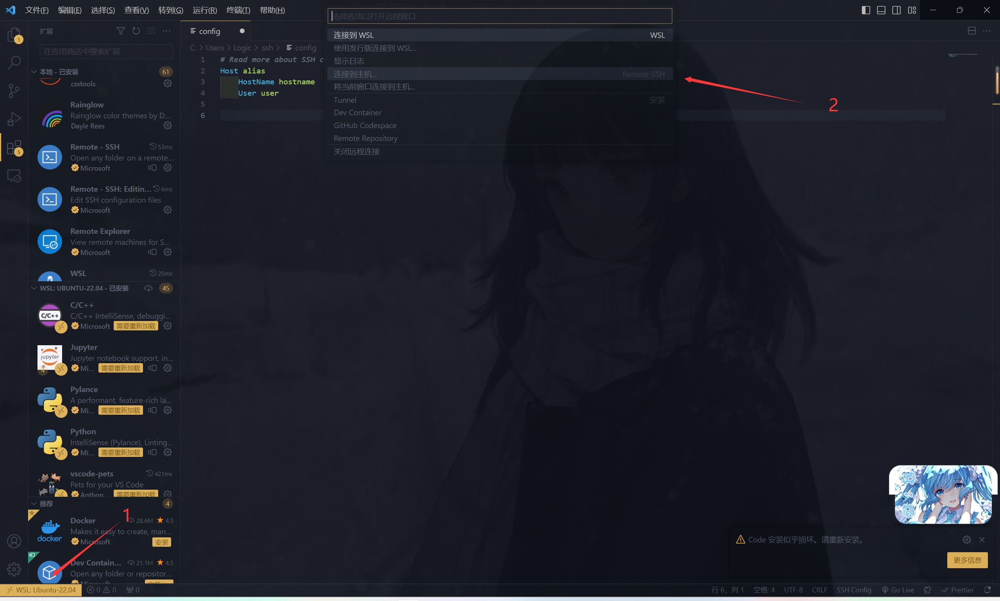
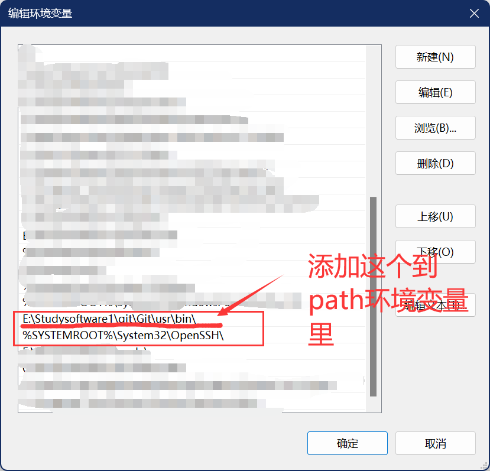

# Docker 的安装
- Docker 是一个开源的商业产品，有两个版本：社区版（Community Edition，缩写为 CE）和企业版（Enterprise Edition，缩写为 EE）。
- Docker CE 的安装请参考[官方文档](https://docs.docker.com/install/)

---
- 镜像加速器：修改 Docker 的官方仓库到国内的镜像网站 [https://docker_practice.gitee.io/install/mirror.html](https://docker_practice.gitee.io/install/mirror.html)
- 《Docker — 从入门到实践》[ https://docker_practice.gitee.io ]( https://docker_practice.gitee.io/ )

---


这里使用的是 Docker for Window。

``` shell
# 安装完成后，运行下面的命令，验证是否安装成功。
$docker version
$docker info

# 如果 docker 服务没有启动，可以用下面的命令启动
# 以下命令仅适用于 Linux 系统 service 命令的用法
$sudo service docker start

# systemctl 命令的用法 (RHEL7/Centos7)
$sudo systemctl start docker
```


## Docker 的 Hello World 示例
```shell
# 抓取官方的 hello-world 镜像：
$sudo docker image pull hello-world

# 查看
$sudo docker images

# 运行这个 image 文件。
$sudo docker container run hello-world

# Hello from Docker!
# This message shows that your installation appears to be working correctly.

# ... ...
# (运行成功！)
```
---

```shell
$sudo docker images	# 查看本机所有的镜像
$sudo docker ps -a	# 查看本机所有的容器

$sudo docker rm [containerID]	# 删除容器
$sudo docker image rm [imageID]	# 删除镜像
```
---

## 一个简单的 APP 示例
``` dockerfile
# Base Image
FROM python:3.10

# 将当前目录下的所有文件(除了.dockerignore排除的路径)
# 都拷贝进入 image 里的/home/ictp_ap目录
COPY . /home/ictp_ap

# 将容器 8000 端口暴露出来， 允许外部连接这个端口
EXPOSE 8000

# 指定接下来的工作路径为/home/ictp_ap
WORKDIR /home/ictp_ap

RUN apt-get update && apt-get install \
        -y --no-install-recommends \
        python3-setuptools \
        python3-pip \
        python3-dev \
        python3-venv \
        git \
        && \
    apt-get clean && \
    rm -rf /var/lib/apt/lists/*

RUN python -c "print('hello world')"

# 将这个 image 做成一个 app 可执行程序
# 容器启动后自动执行下面指令
#（ENTRYPOINT 可加额外的shell参数）
ENTRYPOINT ["bash", "setup.sh"]
```


可以自己打包一个镜像，然后发布。

```shell
#!/bin/bash
sudo docker build -t ictp_ap_jupyter .
```

```shell
$sudo docker stop [containerID]	# 终止容器运行

# 标注用户名和版本
$sudo docker tag [imageName] [username]/[respository]:[tag]

# 发布image文件
$sudo docker image push [username]/[respository]:[tag]
```

发布之后，去这个网站 [Docker](https://hub.docker.com/repository/docker/iphysresearch/ictp_ap_jupyter/general) 查看效果（需要魔法）。

想要自己构建一个 docker，写 dockerfile 的代码的话，可以去 github 上搜索 dockerfile，然后参考别人写的代码，一点点的构建。

# Python / Jupyter 开发环境搭建
```shell
sudo docker pull iphysresearch/ictp_ap_jupyter:1.5
```
从网上 pull 下来 docker 镜像，这里以课上的镜像为例。
```shell
sudo docker run -itd --platform linux/amd64 \
        -p 1234:22 \
        -p 19999:8888 \
        -v /Users/herb/ICTP_AP_course:/home/ICTP_AP_course \
        --name ictp_ap_dev \
        iphysresearch/ictp_ap_jupyter:1.5
```

```shell
ssh -p 1234 root@0.0.0.0
```
进入 docker 镜像内部，密码是 root

然后在容器内，创建 conda 环境
```shell
# 创建 conda 环境
conda create -n ictp-ap python=3.10 --yes
# 激活 conda 环境
conda activate ictp-ap
# 安装 JupyterNotebook 内核
pip install --upgrade ipykernel
# 安装一个扩展插件
pip install jupyterlab_nvdashboard

# 给 ictp-ap conda环境创建同名 kernel
python -s -m ipykernel install \
    --user \
    --name=ictp-ap \
    --display-name="ictp-ap"
```

```shell
nohup jupyter-lab \
    --ip='*' \
    --port=8888 \
    --no-browser \
    --NotebookApp.token='' \
    --allow-root \
    --autoreload \
    --notebook-dir=/home \
    > jupyter.log 2>&1 &
```


## 远程连接 VScode
在 VScode 里安装 Remote-SSH 插件，然后点连接到主机

然后选择配置 SSH 主机，选择~/. ssh/config 配置文件，加入下面的代码
```config
# ~/.ssh/config
Host ICTP_AP_course
  HostName 0.0.0.0
  User root
  Port 1234
```

## 第二次打开
退出之后，再重新打开这个容器
```shell
docker start 容器ID
```

```shell
ssh -p 1234 root@0.0.0.0
```

## 踩坑
用 VScode 远程连接 docker 失败，更改 ssh 的环境变量路径，将 Openssh，改为 git 里的 ssh。

添加 git 的路径后，可以将 git 的路径移到 openssh 的上面。也可以把底下那个 openssh 删掉，然后添加上面 git 的路径。

然后 VScode 的 settings. json 文件里添加上 ssh 的路径。


