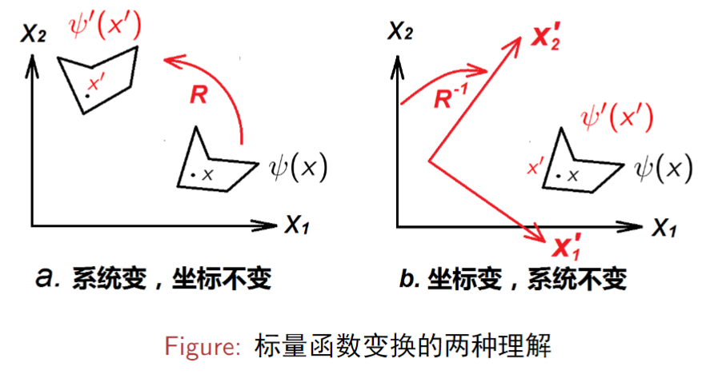

上一章讲了群的基本结构，这一章讲的是如何用数学语言描述群，对应的理论被称为群表示论。

>什么叫做"群的表示"？

简单来说，一个抽象群 $G$ 的表示为另外一个群 $G'$，群 $G$ 与它的表示 $G'$ 同态：
$$
G\simeq G'
$$

线性表示则是群的表示的一种特殊情况：**对应的表示群是矩阵群**。

也可以说是一个群 $G$ 到线性空间 $V$ 上的线性变换群 $G'$ 的同态映射关系。

# 群的线性表示
## 群的线性表示的定义
假设 $G = \{g_{i}\}$ 为一个抽象群， $D(G)$ 是一个矩阵群，群元为 $m$ 阶方阵，并且
$$
G\simeq D(G) = \{D(g_{i})\}
$$
则称 $D(G)$ 为群 $G$ 的一个 $m$ 维线性表示， $D(g_{i})$ 称为群元 $g_{i}$ 在该表示中的**表示矩阵**。

- 如果 $G\cong D(G)$，则这个表示称为群 $G$ 的**真实表示**。 #真实表示
- 如果非同构，则这个表示称为群 $G$ 的**非真实表示**。 #非真实表示

非真实表示描写了群 $G$ 关于同态核的商群的性质：
$$
G / I \cong D(G)
$$
---

一个群可以有很多个表示。两种简单表示：
- 矩阵群是自身的一个表示，称为 **自身表示**。 #自身表示
-  $D (G) = \{E\}$，这种表示称为群的**恒等表示**。 #恒等表示
以上两种表示都称为群的**平庸表示**。 #平庸表示

---

在群的线性表示理论中，某一个群元的表示矩阵的迹 $\operatorname{Tr}D(g_{i})$ 称为该群元在该表示中的**特征标**，记作 : $\chi (g_{i}) = \operatorname{Tr} D(g_{i})$。

---

矩阵群 $D(G)$ 满足不同的限制条件，则对应不同的表示。
- 若对于 $\forall g_{i}\in G$，都有 $D (g_{i})^{\dagger}D (g_{i}) = E$，则称这个表示为群 $G$ 的**幺正表示**。 #幺正表示
- 若对于 $\forall g_{i}\in G$，都有 $D (g_{i})^{T}D (g_{i}) = E$，则称这个表示为群 $G$ 的**正交表示**。 #正交表示

---

> 矩阵群中群元矩阵的性质决定了群表示的类型。

## 线性表示的性质

::: warning 线性表示的性质
- 恒元的表示矩阵是单位矩阵，即 $D (e) = E$.
- 由同态的定义可得： $D (g_{i}) D (g_{j}) = D(g_{i}g_{j})$.
- 群元 $g$ 的逆元 $g^{-1}$ 的表示矩阵是群元 $g$ 的表示矩阵的逆矩阵，即 $D (g_{i}^{-1}) = D(g_{i})^{-1}$.

:::

## 等价表示
一个群的表示严格意义上是无穷多个，但是研究类似重复提高维数而得到的表示是没有什么意义的，我们真正感兴趣的表示是不等价、不可约表示。要理解什么是不等价、不可约表示，首先要理解什么是等价、可约。

::: tip 等价表示
设 $D(G)$ 为群 $G$ 的一个 m 维表示，设 $X$ 为一个 $m\times m$ 的非奇异矩阵 $(\det X \neq 0)$，则
$$
\bar{D}(G) = \{ X ^{-1}D(g_{i}) X | g_{i} \in G \}
$$
也构成一个群，且 $D (G) \cong \bar{D}(G)$，我们称 $\bar{D}(G)$ 和 $D(G)$ 为群 $G$ 的**等价表示**，或者说这两个表示等价。

:::

等价表示的定义本身也可以用来 **判定两个表示是否等价**：

设 $D(G)$ 和 $\bar{D}(G)$ 是群 $G$ 的两个表示，如果存在一个行列式不为零的矩阵 $X$ ，对于  $\forall g_{i}\in G$ 使得 $\bar{D}(g_{i}) =X ^{-1} D(g_{i})X$，则这两个表示等价，否则不等价。

## 可约表示和不可约表示

::: tip 可约表示
假设 $D(G)$ 是群 $G$ 的一个 $m$ 维表示，若存在一个行列式不为 0 的矩阵 $X$，使得
$$
\bar{D}(G) = X ^{-1} D(G)X
$$
其中，
$$
\bar{D}(G) = \begin{bmatrix}
D_{1}(G) & 0 \\
0 & D_{2}(G)
\end{bmatrix}
$$
或者，对 $\forall g_{i} \in G$ 都有
$$
\bar{D}(g_{i}) = X ^{-1} D(G) X  = \begin{bmatrix}
D_{1}(g_{i})_{k\times k}  &  0 \\
0 & D_{2}(g_{i})_{l\times l}
\end{bmatrix}
$$
则称 $D(G)$ 为群 $G$ 的一个**可约表示**，否则称为**不可约表示**。
:::

简单来说就是，如果 $D(G)$ 存在一个呈块对角矩阵的等价表示，那么 $D(G)$ 就是群 $G$ 的可约表示。如果不存在，就是不可约表示。

::: warning 
**可约表示的等价表示依然是可约表示；不可约表示的等价表示依然是不可约表示。**（证明使用反证法）
:::

:::  warning 
**约化后的准对角元构成的矩阵群都分别为 $G$ 的表示**。
:::
即，上面 $D_{1}(G)$ 和 $D_{2}(G)$，都与群 $G$ 同态，是群 $G$ 的表示。

## 可约表示的约化

约化后的每个准对角元构成的矩阵群都为群 $G$ 的线性表示，那么就可以进一步讨论，每个准对角元是否是群 $G$ 的可约表示，如果是，继续约化，直到得到不可约的对角元。这个过程就被称为可约表示的**约化**。

设 $\tilde{D}_{k}(G)$ 是 $G$ 的第 $k$ 个不等价、不可约表示（$k = 1,2,3,\dots,r$），我们将 $D(G)$ 的约化记为：
$$
X ^{-1} D(G)X  = \bigoplus _{k = 1}^{r} n_{k}\tilde{D}_{k}(G)
$$
其中，
$$
\begin{bmatrix}
A  &   \\
  & B
\end{bmatrix} = A\oplus  B
$$

---
>这一节主要说明了线性表示的定义和性质，以及基于线性表示的分类，等价表示和不等价表示，可约表示和不可约表示。

# 标量函数的变换算符与表示的构造

## 标量函数
标量函数用来描述标量场。
- **它是空间坐标的函数**。
- **在空间的每一个坐标点处，标量函数 $\phi(x)$ 的值都是标量。**

## 标量函数的变换算符
当物理系统（标量场）发生改变时，标量函数的变换有两种理解的方式：
- **系统变坐标不变**：保持坐标轴不变而改变系统本身。
- **坐标变系统不变**：保持系统本身不变而改变坐标轴。

>**标量函数的形式不随坐标的变换而改变**。

即： $\psi' (x') = \psi (x)$，将坐标变换记作 $R$，即
$$
R: x\to x', \quad x' = Rx \text{或} x = R^{-1}x'
$$
要是想保持标量函数的形式不变，则在相应的坐标变换后，**标量函数在新坐标下的形式也应该发生相应的变换**，即由 $\psi$ 变为 $\psi'$。
$$
P_{R}\psi \equiv \psi',\quad P_{R}\psi(x') = \psi'(x')
$$
>这里的意思其实就是：**标量函数的形式不随坐标变换而改变 = 坐标变换+标量函数形式变换**

$$
P_{R}\psi(x) = \psi'(x) = \psi(R^{-1} x)
$$

## $\{ R \}$ 和 $\{ P_{R} \}$ 同构

然后考虑上面所说的那两个变换，**如果 $\{ R \}$ 是一个群，则 $\{ P_{R} \}$ 也是一个群，并且可以证明这两个群同构**。

证明思路：
- 先证明 $P_{R}$ 是线性算符：这个其实很好证明，就是作用在两个不同函数的加和上，然后证明等同于先分别作用再求和。
- 再证明 $P_{SR} = P_{S}P_{R}$
- 接下来再证明 $\{ R \}\simeq \{ P_{R} \}$
- 最后再证明这种关系是一一对应的

## 线性表示的构造

**可以用一组完备的基矢 $\psi\equiv(\psi_{1}, \psi_{2},\cdots, \psi _{n})$ 来展开一个函数空间中的任意函数**。
将 $P_{R}$ 作用在 $\psi _{\mu}$ 上，得到的新函数可以用原来的基矢展开
$$
P_{R}\psi _{\mu}(x) = \psi'_{\mu}(x) = \sum _{\nu}\psi _{\nu}(x)D(R)_{\nu \mu}
$$
上式也可以写成矩阵的形式
$$
\begin{align}
P_R(\psi_1~\psi_2\cdots\psi_n)&=(\psi_1^{\prime}~\psi_2^{\prime}\cdots\psi_n^{\prime})\\ 
&=(\psi_1~\psi_2\cdots\psi_{n}) \begin{bmatrix}
D_{11}(R)&\cdots&D_{1n}(R)\\\vdots&\ddots&\vdots\\D_{n1}(R)&\cdots&D_{nn}(R)
\end{bmatrix}
\end{align}
$$

上式也可以简写为 $R_{R}\psi = \psi D(R)$。**可以证明 $\{ D(R) \}$ 构成 $\{ P_{R} \}$ 的一个 $n$ 维线性表示**，即
$$
\{ P_{R} \}\simeq \{ D(R) \}
$$

---
再考虑前面提到的 $P_{S}P_{R} = P_{SR}$，则
$$
P_{S}P_{R}\psi_{\mu}=P_{SR}\psi_{\mu}=\sum_{\nu}\psi_{\nu}D(SR)_{\nu\mu}=\sum_{\nu}\psi_{\nu}(D(S)D(R))_{\nu\mu}
$$

因此：$D (S) D (R) = D(SR)$

---
- 表示的维数就是函数空间中**完备基矢的个数**。
- 函数空间满足 $P_{R}\psi _{\mu }\in \text{函数空间}\{\psi _{\mu}\}$，所以是**不变空间**。

对于这个函数空间的子空间：
- 如果子空间和其补空间都是不变子空间，则对应的表示是**完全可约表示**。前面我们定义的可约表示其实为完全可约表示。
- 如果子空间是不变空间，其补空间不是不变空间，则对应的表示是**不完全可约**的。不完全可约可以化为准上三角阵的形式。
- **完全可约表示可以再约化**。

---

::: warning
**有限群的不等价不可约表示的个数等于类的个数**。

:::

# 有限群表示理论的基本定理

::: warning 定理 1
**有限群的线性表示等价于幺正表示**。
即：
$$
X ^{-1} D(G)X = \bar{D}(G)
$$
$$
\bar{D}^{\dagger}(g_{\alpha})\bar{D}(g_{\alpha}) = E,\quad \text{对于}\forall g_{\alpha}\text{都成立}
$$
:::

::: warning 定理 2
**假设 $D(G)$ 和 $\bar{D}(G)$ 为群 $G$ 的等价的幺正表示，则一定存在一个幺正矩阵 $U$ 将这二者关联起来**。
$$
\bar{D}(G) = U^{-1}D(G)U
$$
:::

::: warning 定理 3 舒尔（Schur）定理
- 设 $D(G)$ 为群 $G$ 的不可约表示，且
$$
D(G)M = MD(G)
$$
则 $M$ 为常数矩阵，即：$M = cE$。
- 设 $D_{1}(G)$ 和 $D_{2}(G)$ 为群 $G$ 的两个不等价不可约表示，且
$$
D_{1}(G)M = MD_{2}(G)
$$
则 $M = 0$。

:::

::: warning 定理 4 正交性定理
设群 $G$ 有 $r$ 个不等价不可约幺正表示 $D^{(u)}(G),\quad(u = 1, 2, \cdots,r)$，则
$$
\sum_{\alpha=1}^{n_G}D^{(u)}(g_\alpha)_{\gamma\eta}^*D^{(v)}(g_\alpha)_{\lambda\rho}=\frac{n_G}{n_u}\delta^{u\nu}\delta_{\gamma\lambda}\delta_{\eta\rho}
$$

其中 $n_{G}$ 为群 $G$ 的阶， $n_{u}$ 为第 $u$ 个不可约表示 $D^{(u)}(G)$ 的维数。
:::

::: warning 定理 5
**有限群的不等价不可约表示的个数等于群的类的个数**。
:::

# 群的正则表示
## 群空间
如果用**有限群** $G$ 的所有群元 $\{ g_{\alpha} \}$ 作为基矢，则由基矢 
$$
v = (g_{1}, g_{2}, g_{3}, \cdots, g_{n})
$$
所形成的 **线性空间**称为**群空间**。

群空间内的矢量可以用这组基矢的线性叠加表示出来：
$$
\left.f=x_1g_1+x_2g_2+\cdots+x_ng_n=(g_1,g_2,g_3,\cdots,g_n)\left(\begin{array}{c}x_1\\x_2\\\vdots\\x_n\end{array}\right.\right)=v\cdot x
$$

## 群的正则表示
**以群空间为表示空间的表示称为正则表示**。

对于群空间内任意矢量 $f$：
$$
g_{\alpha}: f \to f'
$$
$$
\begin{aligned}
&=\quad g_{\alpha}f=g_{\alpha}v\cdot x \\
&=\quad g_\alpha(x_1g_1+\cdots+x_ng_n) \\
&=\quad x_{1}g_{\alpha}g_{1}+x_{2}g_{\alpha}g_{2}+\cdots+x_{n}g_{\alpha}g_{n} \\
&=\quad v\cdot D(g_\alpha)\cdot x=v^{\prime}\cdot x=v\cdot x^{\prime}.
\end{aligned}
$$

上面的式子可以有两种理解：
- $v' = v D(g_{\alpha})$，**坐标保持不变而基矢变换**。
- $x'= D(g_{\alpha})x$，**基矢不变而坐标变换**。

## 正则表示的特点

- **除恒元外，其余群元的表示举证的对角元都为 0**
$$
\left.\chi(g_\alpha)=\left\{\begin{array}{cc}n_G&g_\alpha=e\\0&g_\alpha\neq e\end{array}\right.\right.
$$
- **正则表示的维数为群 $G$ 的阶数**.
-  $G\cong D(G)$
- **任何有限群都有正则表示**。

# 特征标相关理论

## 特征标
群的线性表示建立了**抽象群和矩阵群之间的一个同态关系**。

::: tip 特征标
**群元表示矩阵的迹**定义为该群元的**特征标**：
$$
\chi(g_\alpha)=\text{Tr}D(g_\alpha)=\sum_{i=1}^{n_D}D(g_\alpha)_{ii}
$$
:::

对于与 $g_{\alpha}$ 共轭的元素，它们的特征标为：
$$
\begin{aligned}
\chi(f^{-1}g_{\alpha}f)& =\quad\mathbf{Tr}D(f^{-1}g_\alpha f)=\mathbf{Tr}\Big(D(f^{-1})D(g_\alpha)D(f)\Big)  \\
&=\quad\mathbf{Tr}\left(D(f)D(f^{-1})D(g_\alpha)\right)=\mathbf{Tr}(D(g_\alpha))=\chi(g_\alpha)
\end{aligned}
$$

**所以，同类元素在表示 $D(G)$ 中的特征标相同，即特征标是类的函数**。

>也就是能够通过特征标是否相同来判断元素是否是一类，通过一个元素的特征标来确定其他与其同类的元素的特征标。

## 特征标定理

::: warning 特征标定理 1 
**如果两个表示等价，则特征标相同。**
:::

::: warning 特征标定理 2：特征标正交关系定理
假设群 $G$ 有 $r$ 个不等价不可约表示 $D^{(u)}(G)(u = 1, \cdots,r)$，则
$$
\sum _{\alpha = 1}^{n_{G}} \chi ^{(u)}(g_{\alpha})^{*}\chi ^{(v)}(g_{\alpha}) = n_{G}\delta ^{uv}
$$
其中 $\chi ^{(u)(g_{\alpha})}$ 为 $g_{\alpha}$ 在表示 $D^{(u)}(G)$ 中的特征标。
:::

为了更好地理解特征标的正交定理，引入**特征标表**：

|           |       $g_{1}$        |       $g_{2}$        | $\cdots$ |       $g_{n}$        |
| --------- |:--------------------:|:--------------------:| -------- |:--------------------:|
| $D^{(1)}$ | $\chi ^{(1)}(g_{1})$ | $\chi ^{(1)}(g_{2})$ | $\cdots$ | $\chi ^{(1)}(g_{n})$ |
| $D^{(2)}$ | $\chi ^{(2)}(g_{1})$ | $\chi ^{(2)}(g_{2})$ | $\cdots$ | $\chi ^{(2)}(g_{n})$ |
| $\vdots$  |       $\vdots$       |       $\vdots$       | $\ddots$ |       $\vdots$       |
| $D^{(r)}$ | $\chi ^{(r)}(g_{1})$ | $\chi ^{(r)}(g_{2})$ | $\cdots$ | $\chi ^{(r)}(g_{n})$ |

特征标表的某一行元素为不同群元在某一不可约表示中的特征标，称为**特征标行矢量**，特征标作为群空间中的矢量。

特征标表的某一列元素为同一群元在各个不等价不可约表示中的特征标，称为**特征标列矢量**。

从特征标表看，正交定理可以认为是：**特征标表的任意不同两行正交**，对于同一行， $u=v$，所以：
$$
\sum _{\alpha =1}^{n_{G}}\lvert \chi ^{(u)}(g_{\alpha}) \rvert ^{2} = n_{G}
$$
这也是不可约表示必须满足的条件，即**在不可约表示下所有群元的特征标的模方和等于群的阶**。

>这个可以用来判断一个表示是否为不可约表示。

::: warning 特征标定理 3：唯一分解定理
设 $D(G)$ 为 $G$ 的一个表示，**$D^{(u)}(G)$ 为 $G$ 的所有 $r$ 个不等价不可约表示**，则由表示的约化知 $D(G)$ 可以**约化**为：
$$
X^{-1}D(G)X=\bigoplus_{u=1}^ra_uD^{(u)}(G)
$$
其中 $a_{u}$ 是唯一确定的：
$$
a_{u}= \frac{1}{n_{G}}\sum _{\alpha=1}^{n_{G}}\chi(g_{\alpha})^{*}\chi ^{(u)}(g_{\alpha})
$$

:::

::: tip
可约表示特征标矢量的内积：
$$
\sum_\alpha\chi(g_\alpha)^*\chi(g_\alpha)\geq2n_G
$$
:::

::: tip 
**群的不等价不可约表示的维数的平方和等于群的阶：
$$
\sum_{u =1}^{r}n_{u}^{2} = n_{G}
$$

:::

::: warning 特征标定理 4
**如果两个表示等价，则特征标相同；如果特征标相同，则两个表示等价。**
:::

> 两个表示等价 $\leftrightarrow$ 特征标相同

## 特征标表的性质

1. 首先，**特征标表是一个 $r\times r$ 的方阵**，$r$ 为不等价不可约表示的个数（类的个数）。
2. **任意两行正交**：
$$
\sum_{\alpha = 1}^{r}\hat{\chi}^{(u)}(C_{\alpha})^{*}\hat{\chi}^{(v)}(C_{\alpha}) = \delta ^{uv}
$$
3. **任意两列正交**：
$$
\sum_{u = 1}^{r}\hat{\chi}^{(u)}(C_{\alpha})^{*}\hat{\chi}^{(u)}(C_{\beta}) = \delta _{\alpha \beta}
$$
4. **特征标行/列矢量的模方为 1**：
$$
\sum_{\alpha=1}^r\left|\hat{\chi}^{(u)}(C_\alpha)\right|^2=1,\quad\sum_{u=1}^r\left|\hat{\chi}^{(u)}(C_\alpha)\right|^2=1.
$$
5. **第一列：$\frac{1}{n_{G}}\sum_{u=1}^{r}n_{u}^{2} = 1$**, 其中 $n_{u}$ 为 $D^{(u)}$ 的维数。
6. **商群的不可约表示也是原群的不可约表示**。
7. **群 $G$ 的一维非恒等表示和高维不可约表示相乘，还是 $G$ 的不可约表示**。
8. **设 $G = H_{1}\otimes H_{2}$，则群 $G$ 的类的个数为其子群 $H_{1}$ 和  $H_{2}$ 的类的个数的乘积**。$G$ 的阶是 $H_{1}$ 和 $H_{2}$ 阶的乘积；$G$ 的不等价不可约表示都可以表示成这两个子群 $H_{1}$ 和 $H_{2}$ 的不可约表示的直积。
