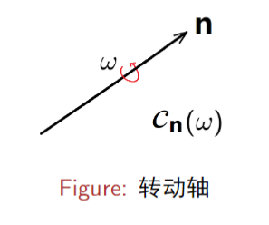

# 实正交群 $O(3)$.
## 实正交变换矩阵

对于 $R^{3}$ 空间中的矢量，**实正交变换前后，矢量的模长保持不变**。也就是 $(gx)^{T}(gx) = x^{T}x$，其中 $g$ 为实正交变换矩阵，$x$ 为矢量。所以

$$
g^{T}g = E  \leftrightarrow g ^{-1} = g
$$

两边同时取行列式可得

$$
\det (g^{T})\det(g) = (\det(g))^{2} = 1
$$

因此

$$
\det(g) =\pm 1
$$

> 所以实正交变换矩阵主要有两个特点，一个是其与其自身的转置的乘积为单位矩阵，另一个是行列式为 $\pm 1$。

## 实正交矩阵群 $O (3)$.

$$
O (3)=\{g\mid g \text{为}3\times 3\text{矩阵},\:g^Tg=E\}
$$

## 实特殊（幺模）正交群 $SO (3)$.

$$
SO (3)=\{g\mid g \in O (3), \text{且} \det (g) = 1\}
$$

$SO (3)$ 群中的任意矩阵都可以通过参数的连续变化变换到恒元。

$SO (3)$ 群的群空间是 **双连通的**。

**$SO (3)$ 是 $O (3)$ 群的不变子群。**

::: warning 实特殊正交群定理
对于 $\forall g \in SO (3)$，总存在一个**矢量 $\mathbf{n}$** ，使得

$$
G \mathbf{n} = \mathbf{n}
$$

该定理表明：**$SO (3)$ 的任一元素 $g$ 都可以表示为绕某一转动轴 $\mathbf{n}$，转动 $\omega$ 角度的操作： $g = C_{\mathbf{n}}(\omega)$**。

:::

## $SO (3)$ 群的共轭类
对于 $\forall f= C_{\mathbf{k}}(\omega)\in SO (3)$，与 $f$ 共轭的元素为

$$
GC_{\mathbf{k}}(\omega) g ^{-1}
$$

因为

$$
(gC_{\mathbf{k}}(\omega) g ^{-1})(g\mathbf{k}) = gC_{\mathbf{k}}(\omega )\mathbf{k} =g\mathbf{k} 
$$

所以**共轭元素 $gC_{\mathbf{k}}(\omega) g ^{-1}$ 的转动轴为 $g \mathbf{k}$**。

因此可以把共轭元素记为

$$
GC_{\mathbf{k}}(\omega) g ^{-1} = C_{g\mathbf{k}}(\omega')
$$

可以证明 $\omega = \omega'$，因此，**$SO (3)$ 群中转动角度相同的群元在同一类中**。

## $C_{\hat{n}(\theta,\varphi)}(\omega)$ 的指数表示

用 Pauli 矩阵和单位矩阵 $E$，作为由 $2\times 2$ 的厄米矩阵构成的复 Hilbert 空间的四个基矢。
$$
E = \begin{bmatrix}
1 & 0  \\
0 & 1
\end{bmatrix}, \quad \sigma_{1} = \begin{bmatrix}
0 & 1 \\
1 & 0
\end{bmatrix}, \quad \sigma_{2} = \begin{bmatrix}
0 & -i  \\
I & 0 
\end{bmatrix}, \quad \sigma_{3} = \begin{bmatrix}
1 & 0 \\
0 & -1
\end{bmatrix}
$$

::: tip
$e^{A}$ 可以用级数展开：
$$
E^{A} = \sum^{\infty}_{n = 0} \frac{A^{n}}{n!}
$$

:::

例如，将 $e^{-i \omega \sigma_{2}}$ 按照级数展开，则有：
$$
\begin{aligned}
E^{-i\omega\sigma_2}& =\quad\sum_{n=0}^{\infty}\frac 1{n!}(-i\omega\sigma_{2})^{n}\quad (\sigma_{2}^{0}=E,\:\sigma_{2}^{2}=E,\:\sigma_{2}^{3}=\sigma_{2},\:\sigma_{2}^{4}=E)  \\
&=\quad E\left (1-\frac{\omega^2}{2!}+\frac{\omega^4}{4!}-\cdots\right)-i\sigma_2\left (\omega-\frac{\omega^3}{3!}+\frac{\omega^5}{5!}-\cdots\right) \\
&=\quad E\cos\omega-i\sigma_2\sin\omega  \\
&\left.=\quad\cos\omega\left[\begin{array}{cc}1&0\\0&1\end{array}\right.\right]-i\sin\omega\left[\begin{array}{cc}0&-i\\i&0\end{array}\right] \\
&\left.=\quad\left[\begin{array}{cc}\cos\omega&-\sin\omega\\\sin\omega&\cos\omega\end{array}\right.\right]
\end{aligned}
$$

转换到 3 维，比如：
$$
\sigma_{2}\to T_{3} = \begin{bmatrix}
0 & -i &  \\
I & 0 &  \\
 &  & 0
\end{bmatrix}
$$

将 $e^{-i\omega T_{3}}$ 按照级数展开，可得：
$$
T_{3} = \begin{bmatrix}
0 & -i &  \\
I & 0 &  \\
 &  & 0
\end{bmatrix}, \quad e^{-i\omega T_{3}} = \begin{bmatrix}
\cos \omega  & -\sin \omega  & 0 \\
\sin \omega & \cos \omega & 0 \\
0 & 0 & 1
\end{bmatrix} = C_{\mathbf{k}}(\omega)
$$

同理可得
$$
T_{2} = \begin{bmatrix}
0 &  & i  \\
 & 0 &  \\
-i &  & 0
\end{bmatrix}, \quad e^{-i\omega T_{2}} = \begin{bmatrix}
\cos \omega  &  0 & \sin \omega \\
0 & 1 &  0 \\
-\sin \omega  & 0 & \cos \omega
\end{bmatrix} = C_{\mathbf{j}}(\omega)
$$

$$
T_{1} = \begin{bmatrix}
0 &  &  \\
 & 0 & -i  \\
 & i & 0
\end{bmatrix}, \quad e^{-i\omega T_{1}} = \begin{bmatrix}
  1 & 0 & 0 \\
0 & \cos \omega & -\sin \omega \\
0 & \sin \omega & \cos \omega
\end{bmatrix} = C_{\mathbf{i}}(\omega)
$$

绕任意转动轴的转动 $C_{\hat{n}(\theta,\varphi)}(\omega)$，可以通过对绕 $z$ 轴的转动的相似变换得到：
$$
\begin{aligned}
C_{\hat{n}(\theta,\varphi)}(\omega)& =\quad S (\varphi,\theta) C_{\mathbf{k}}(\omega) S (\varphi,\theta)^{-1}  \\
&=Se^{-i\omega T_3}S^{-1} \\
&=S\left (\sum_n^\infty\frac{(-i\omega T_3)^n}{n!}\right) S^{-1} \\
&= \sum_n^\infty\frac 1{n!}S (-i\omega T_3) S^{-1}S (-i\omega T_3) S^{-1}S\cdots S (-i\omega T_3) S^{-1}  \\
&=\sum_n^\infty\frac 1{n!}(S (-i\omega T_3) S^{-1})^n \\
&= e^{-i\omega ST_3 S^{-1}}\quad (ST_3 S^{-1}=n_iT_i) \\
&=-e^{-i\omega n_iT_i}
\end{aligned}
$$
其中：
$$
\left.\left[\begin{array}{c}\omega_1\\\omega_2\\\omega_3\end{array}\right.\right]=\left[\begin{array}{c}\omega n_1\\\omega n_2\\\omega n_3\end{array}\right]=\left[\begin{array}{c}\omega\sin\theta\cos\varphi\\\omega\sin\theta\sin\varphi\\\omega\cos\theta\end{array}\right]
$$

# 点群

# 晶体点群
