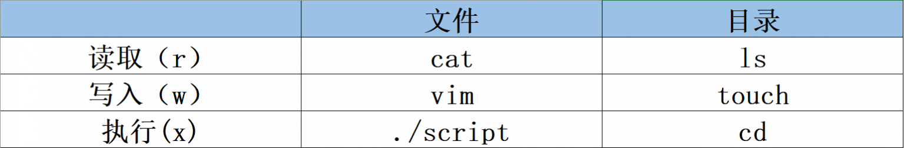
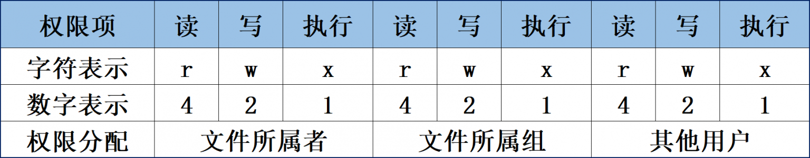

本节为[第一章编程开发环境与工作流]( https://slides.com/iphysresearch/gwda_coding_1#/2/4 ) 的 Linux 部分的学习总结笔记（需要魔法才能打开~）
# 执行 Linux 命令的必备知识
Linux 命令的格式：
`>> 命令名称  [命令参数]  [命令对象]`

- 命令名称：语法中的"动词"
- 命令参数：用于对命令的调整，“长格式” vs “短格式”
- 命令对象：命令执行后的“承受方”

> - 约定俗成地将可选择的、可加或可不加的、非必需的参数使用中括号 [ ] 引起来。
>- 命令名称、命令参数与命令对象之间要用空格进行分隔，且字母严格区分大小写。
>- 用 man 命令查询指令的帮助手册
>- **Tab 键：** 在 Bash 解释器的快捷键中，Tab 键绝对是使用频率最高的，它能够实现对命令、参数或文件的内容补全。
>- **Ctrl+c 组合键：** 当同时按下键盘上的 Ctrl 和字母 c 的时候，意味着终止当前进程的运行。
>- **Ctrl+d 组合键：** 当同时按下键盘上的 Ctrl 和字母 d 的时候，表示键盘输入结束。
>- **Ctrl+L 组合键：** 当同时按下键盘上的 Ctrl 和字母 L 的时候，会清空当前终端中已有的内容（相当于清屏操作）。

# 基础命令
```shell
$ man
# 空格键：	下翻一页
# PaGe down	向下翻一页
# PaGe up	向上翻一页
# home		直接前往首页
# end		直接前往尾页
# /	从上至下搜索某个关键词，如“/linux”
# ?	从下至上搜索某个关键词，如“?linux”
# n	定位到下一个搜索到的关键词
# N	定位到上一个搜索到的关键词
# q	退出帮助文档

$ pwd
$ reboot
$ ls
$ clear
$ date

```
使用 `man` 指令来查询命令文档。

## 常用的系统工作命令
```shell
$ echo [字符串] [$变量]
$ date [+指定的格式]
$ reboot	# 最好是以root管理员的身份来重启
$ poweroff	# 同上
$ shutdown now -r  # 立刻重启
$ wget [参数] 网址
#	-b 后台下载模式
#	-P 下载到指定目录
#	-c 断点续传
#	-r 递归下载
$ ps [参数]	# 查看系统中的进程状态
#	-a 显示所有进程（包括其他用户的进程）
#	-u 用户以及其他详细信息
#	-x 显示没有控制终端的进程
$ ps -aux
$ ps -ef	# *所有进程*的*完整*信息
#	UID 进程的用户ID
#	PID 进程的唯一标识符，即进程ID
#	PPID：父进程的进程ID
#	C：进程的CPU使用率
#	STIME：进程的启动时间
#	TTY：进程所属的终端
#	TIME：进程的运行时间
#	CMD：进程的命令
```

>- 长格式和长格式之间不能合并，长格式和短格式之间也不能合并，但短格式和短格式之间是可以合并的，合并后仅保留一个减号（-）即可。
>- 另外 ps 命令可允许参数不加减号（-），因此可直接写成  ps aux的样子。

```shell
$ top			# 动态地监视进程活动及系统负载等信息
$ kill [参数] 进程的PID	# 终止某个指定PID值的服务进程
$ killall [参数] 服务名称	# 终止某个指定名称的服务所对应的全部进程
```

## 系统状态检测命令

```shell
$ ifconfig [参数] [网络设备]	# 获取网卡配置与网络状态等信息
$ ping [参数] 主机地址		# 测试主机之间的网络连通性
$ uname -a
#	内核名称、主机名、内核发行版本、节点名、压制时间、
#	硬件名称、硬件平台、处理器类型以及操作系统名称
$ uptime	# 查看系统的负载信息
$ free -h	# 当前系统中内存的使用量信息
```

>- 如果有些命令在执行时不断地在屏幕上输出信息，影响到后续命令的输入，则可以在执行命令时在末尾添加一个  &符号，这样命令将进入系统后台执行。
>- 建议负载值保持在1左右，在生产环境中不要超过5就好。

```shell
$ history [-c]	# 显示执行过的命令历史
# 历史命令会被保存到用户家目录中的.bash_history文件中
$ cat ~/.bash_history
$ htop		# 交互式进程查看器
$ watch
```


##  查找定位文件命令

```shell
$ pwd	# 显示用户当前所处的工作目录
$ cd [参数] [目录]
$ ls [参数] [文件名称]
$ ls -lth
$ chmod	# 设置文件的一般权限及特殊权限
```

>- Linux 系统中以点（.）开头的文件均代表隐藏文件，这些文件大多数为系统服务文件。
>- **Ctrl+r 快捷键**：在 Linux 中使用 Ctrl+r 可以进入反向搜索模式，在该模式下，输入关键字会搜索之前输入的命令历史记录，并显示最近一次匹配该关键字的命令。若想查找上一条匹配，可以重复按下 Ctrl+r, 直到找到所需的命令为止。另外，也可以按下 Enter 键执行当前匹配的命令

```shell
$ find [查找范围] 寻找条件	# 按照指定条件来查找文件所对应的位置
#	-name	匹配名称
#	-perm	匹配权限（mode为完全匹配，-mode为包含即可）
#	-user	匹配所有者
#	-group	匹配所有组
#	-mtime -n +n	匹配修改内容的时间（-n指n天以内，+n指n天以前）
#	-atime -n +n	匹配访问文件的时间（-n指n天以内，+n指n天以前）
#	-ctime -n +n	匹配修改文件权限的时间（-n指n天以内，+n指n天以前）
#	-nouser	匹配无所有者的文件
#	-nogroup	匹配无所有组的文件
#	-newer f1 !f2	匹配比文件f1新但比f2旧的文件
#	-type b/d/c/p/l/f	匹配文件类型（后面的字幕字母依次表示块设备、目录、字符设备、管道、链接文件、文本文件）
#	-size	匹配文件的大小（+50KB为查找超过50KB的文件，而-50KB为查找小于50KB的文件）
#	-prune	忽略某个目录
#	-exec …… {}\;	后面可跟用于进一步处理搜索结果的命令

# 获取保存系统配置文件的目录/etc中所有以host开头的文件列表
$ find /etc -name "host*" -print
# 在整个文件系统中找出所有归属于 ubuntu 用户的文件并复制到 /root/findresults 目录中
$ find / -user ubuntu -exec cp -a {} /root/findresults/ \;
# 重点是“-exec {} \;”参数，其中的{}表示find命令搜索出的每一个文件，并且命令的结尾必须是“\;”。
```

```shell
$ whereis 命令名称	# 按照名称快速搜索二进制程序（命令）、源代码以及帮助文件所对应的位置
$ which 命令名称	# 按照指定名称快速搜索二进制程序（命令）所对应的位置
```

```shell
$ df -h			# 查看磁盘占用的空间
$ du -sh 目录/文件	# 查看目录/文件的真实大小
```


## 用户身份与文件权限

```shell
$ id [用户名]	# 显示用户的详细信息
$ useradd [参数] 用户名
$ passwd [参数] 用户名
$ userdel [参数] 用户名
$ su [用户名]	# 切换用户身份
$ sudo [参数] 用户名	# 把特定命令的执行权限赋予指定用户
$ visudo [参数]	# 编辑、配置用户sudo的权限文件
```

具体可以查看这篇文章 [第5章 用户身份与文件权限 | 《Linux就该这么学》 (linuxprobe.com)](https://www.linuxprobe.com/basic-learning-05.html)。





>- **授权原则**：在保证普通用户完成相应工作的前提下，尽可能少地赋予额外的权限。
>- visudo 格式：谁可以使用允许使用的主机 = （以谁的身份） 可执行命令的列表


## 文件文本编辑命令

```shell
$ cat [参数] 文件名称	# 查看纯文本文件（内容较少的）
$ cat -n 文件名称	# 顺便显示行号
$ more [参数] 文件名称	# 查看纯文本文件（内容较多的）
$ head [参数] 文件名称	# 查看纯文本文件的前 N 行
$ tail [参数] 文件名称	# 查看纯文本文件的后 N 行
$ tail -f 文件名称	# 能够持续刷新一个文件的内容
$ wc [参数] 文件名称	# 统计指定文本文件的行数、字数或字节数
#	-l	只显示行数
#	-w	只显示单词数
#	-c	只显示字节数
$ wc -l /etc/passwd	# 统计当前系统中有多少个用户
$ stat 文件名称	# 查看文件的具体存储细节和时间等信息
#	Access Time（内容最后一次被访问的时间，简称为Atime）
#	Modify Time（内容最后一次被修改的时间，简称为Mtime）
#	Change Time（文件属性最后一次被修改的时间，简称为Ctime）
$ grep [参数] 文件名称	# 按"行"提取文本内容
$ grep -n 文件名称	# 顺便显示行号
$ grep -v 文件名称	# 反选信息
$ grep /sbin/nologin /etc/passwd	# 查找出当前系统中不允许登录系统的所有用户的信息
```

## 文件目录管理命令
```shell
$ touch [参数] 文件名称	# 创建空白文件或设置文件的时间
$ mkdir [参数] 目录名称	# 创建空白的目录
$ mkdir -p 嵌套层叠关系的目录
$ cp [参数] 源文件名称 目标文件名称
#	如果目标文件是目录，则会把源文件复制到该目录中；
#	如果目标文件也是普通文件，则会询问是否要覆盖它；
#	如果目标文件不存在，则执行正常的复制操作。
#	-p	保留原始文件的属性
#	-d	若对象为“链接文件”，则保留该“链接文件”的属性
#	-r	递归持续复制（用于目录）
#	-i	若目标文件存在则询问是否覆盖
#	-a	相当于-pdr（p、d、r为上述参数）
$ rm [参数] 文件名称
#	-f	强制执行
#	-i	删除前询问
#	-r	删除目录
#	-v	显示过程
```


# 管道符、重定向与环境变量
[第3章 管道符、重定向与环境变量 | 《Linux就该这么学》 (linuxprobe.com)](https://www.linuxprobe.com/basic-learning-03.html)
## 输入输出重定向
- 一般键盘作为**输入“流”**，显示器作为**输出“流”**，也可以重定向这些流！
- **标准输入重定向**（STDIN，文件描述符为0）：默认从键盘输入，也可从其他文件或命令中输入。
- **标准输出重定向**（STDOUT，文件描述符为1）：默认输出到屏幕。
- **错误输出重定向**（STDERR，文件描述符为2）：默认输出到屏幕。
 
 输入重定向中用到的符号及其作用：
 
| 符号             | 作用                      |
|----------------|-------------------------|
| 命令 < 文件        | 将文件作为命令的标准输入            |
| 命令 << 分界符      | 从标准输入中读入，直到遇见分界符才停止     |
| 命令 < 文件1 > 文件2 | 将文件1作为命令的标准输入并将标准输出到文件2 |


输出重定向中用到的符号及其作用：

| 符号                               | 作用                                                         |
| ---------------------------------- | ------------------------------------------------------------ |
| 命令 > 文件                        | 将标准输出重定向到一个文件中（清空原有文件的数据）           |
| 命令 2> 文件                       | 将错误输出重定向到一个文件中（清空原有文件的数据）           |
| 命令 >> 文件                       | 将标准输出重定向到一个文件中（追加到原有内容的后面）         |
| 命令 2>> 文件                      | 将错误输出重定向到一个文件中（追加到原有内容的后面）         |
| 命令 >> 文件 2>&1 或 命令 &>> 文件 | 将标准输出与错误输出共同写入到文件中（追加到原有内容的后面） |

## 管道命令符"|"

- 把前一个命令原本要输出到屏幕的信息当作后一个命令的标准输入。


## 重要的环境变量

命令在 Linux 中的执行分为4个步骤：

1. 判断用户是否以绝对路径或相对路径的方式输入命令（如/bin/ls）
2. Linux系统检查用户输入的命令是否为“别名命令”
3. Bash解释器判断用户输入的是内部命令还是外部命令
4. 系统在多个路径中查找用户输入的命令文件，而定义这些路径的变量叫作 PATH，Bash 解释器在这些位置中逐个查找。

Linux 系统中最重要的10个环境变量：

| 变量名称         | 作用               |
|--------------|------------------|
| HOME         | 用户的主目录（即家目录）     |
| SHELL        | 用户在使用的Shell解释器名称 |
| HISTSIZE     | 输出的历史命令记录条数      |
| HISTFILESIZE | 保存的历史命令记录条数      |
| MAIL         | 邮件保存路径           |
| LANG         | 系统语言、语系名称        |
| RANDOM       | 生成一个随机数字         |
| PS1          | Bash解释器的提示符      |
| PATH         | 定义解释器搜索用户执行命令的路径 |
| EDITOR       | 用户默认的文本编辑器       |


>- 将变量和变量值写入到 . bashrc 或者 . bash_profile 文件中，以确保永久能使用它们。


# Vim 编辑器与 Shell 命令脚本

[第4章 Vim编辑器与Shell命令脚本 | 《Linux就该这么学》 (linuxprobe.com)](https://www.linuxprobe.com/basic-learning-04.html)

## Vim

**命令模式**中最常用的一些命令：

| 命令  | 作用                          |
|-----|-----------------------------|
| dd  | 删除（剪切）光标所在整行                |
| 5dd | 删除（剪切）从光标处开始的5行             |
| yy  | 复制光标所在整行                    |
| 5yy | 复制从光标处开始的5行                 |
| n   | 显示搜索命令定位到的下一个字符串            |
| N   | 显示搜索命令定位到的上一个字符串            |
| u   | 撤销上一步的操作                    |
| p   | 将之前删除（dd）或复制（yy）过的数据粘贴到光标后面 |

**末行模式**中最常用的一些命令：

| 命令            | 作用                    |
|---------------|-----------------------|
| :w            | 保存                    |
| :q            | 退出                    |
| :q!           | 强制退出（放弃对文档的修改内容）      |
| :wq!          | 强制保存退出                |
| :set nu       | 显示行号                  |
| :set nonu     | 不显示行号                 |
| :命令           | 执行该命令                 |
| :整数           | 跳转到该行                 |
| : s/one/two    | 将当前光标所在行的第一个 one 替换成 two |
| : s/one/two/g  | 将当前光标所在行的所有 one 替换成 two  |
| :%s/one/two/g | 将全文中的所有one替换成two      |
| ?字符串          | 在文本中从下至上搜索该字符串        |
| /字符串          | 在文本中从上至下搜索该字符串        |


## 编写和执行简单的 Shell 脚本

>- `&&` 是逻辑“与”，只有当前面的语句执行成功的时候才会执行后面的语句。
>- `||` 是逻辑“或”，只有当前面的语句执行失败的时候才会执行后面的语句。
>- `!` 是逻辑“非”，代表对逻辑测试结果取反值；之前若为正确则变成错误，若为错误则变成正确。
>- `&` 表示程序要在后台执行
>- `;` 表示每个命令按照从左到右的顺序来执行，每个命令彼此之间无任何关联，所有命令都要执行


# SSH 服务管理远端设备

```shell
$ ssh [参数] 远程账户@[远程IP地址]
#	-p	指定远程主机的sshd端口号
```

```shell
$ scp [参数] 本地文件 远程账户@远程IP地址:远程目录
#	-v	显示详细的连接进度
#	-P	指定远程主机的sshd端口号
#	-r	用于传送文件夹
#	-6	使用IPv6协议
```

- [scp](https://www.man7.org/linux/man-pages/man1/scp.1.html): 通过 SSH 复制文件，不仅能够通过网络传送数据，而且所有的数据都将进行加密处理。

```shell
$rsync -avzP -e 'ssh -p 端口号' 本地文件 远程账户@远程IP地址:远程目录
```
- [rsync](https://www.man7.org/linux/man-pages/man1/rsync.1.html): 对 scp 进行了改进，它可以检测本地和远端的文件以防止重复拷贝。它还可以提供一些诸如符号连接、权限管理等精心打磨的功能。甚至还可以基于 --partial 标记实现断点续传。

## 不间断会话服务：Screen
Screen 是一款由 GNU 计划开发的用于命令行终端切换的自由软件。用户可以通过该软件同时连接多个本地或远程的命令行会话，并在其间自由切换。GNU Screen 可以看作是窗口管理器的命令行界面版本。它提供了统一的管理多个会话的界面和相应的功能。

- 会话恢复
- 多窗口

```shell
$ screen -S yourname    #-> 新建一个叫 yourname 的 session
$ screen -ls            #-> 列出当前所有的 session
$ screen -r yourname    #-> 回到 yourname 这个session
$ screen -x yourname    #-> 回到 yourname 这个已经 attached session
$ screen -d yourname    #-> 远程 detach 某个session
$ screen -d -r yourname #-> 结束当前 session 并回到 yourname 这个 session
```

