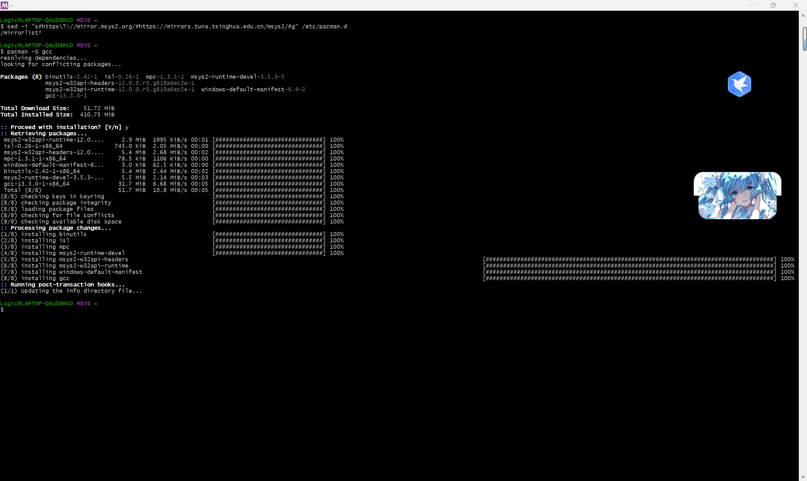
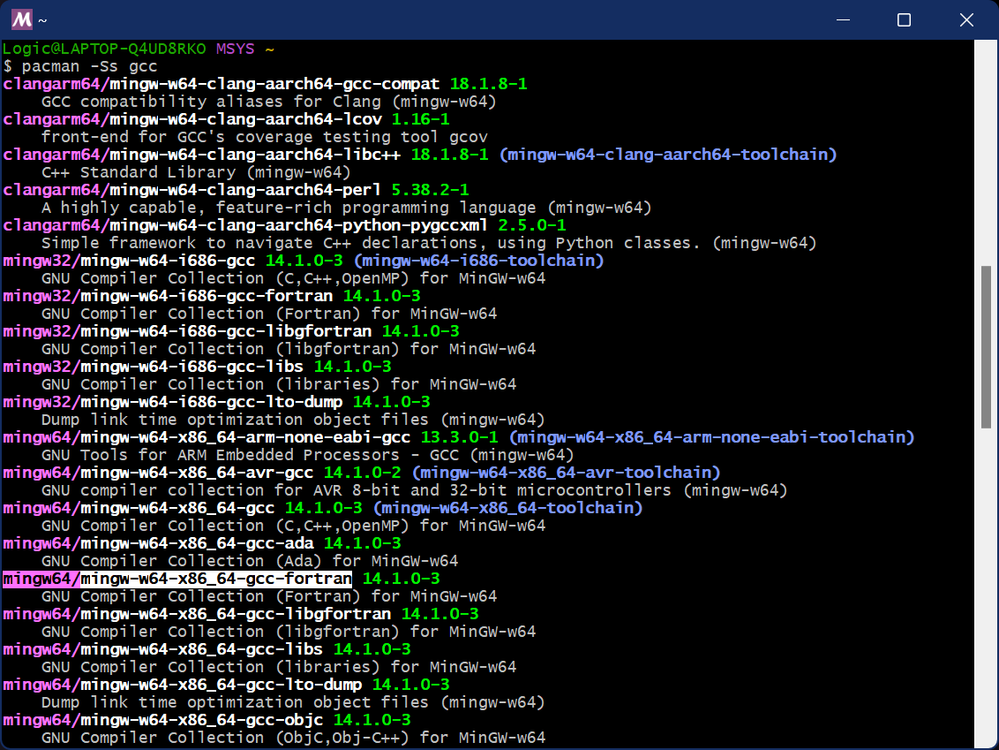
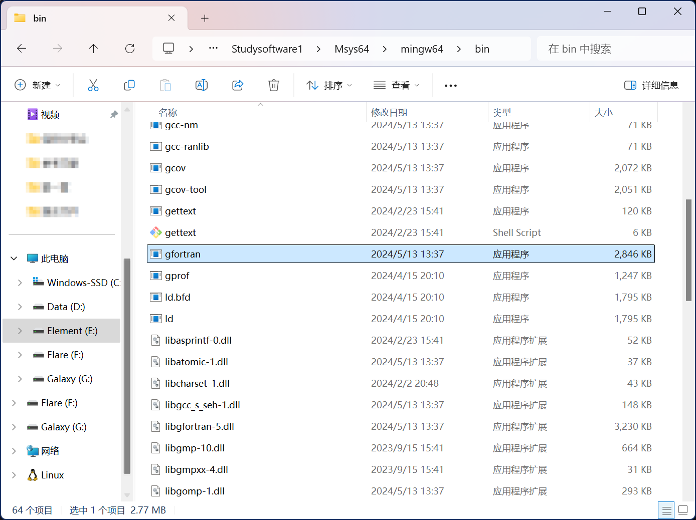
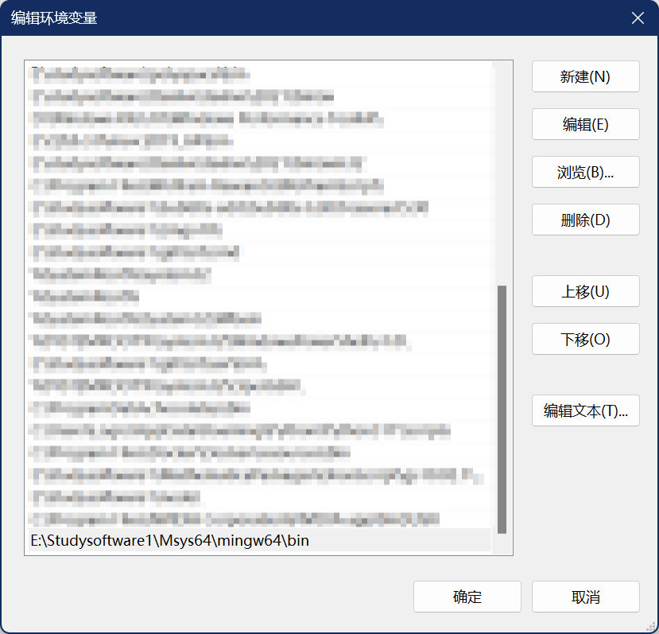
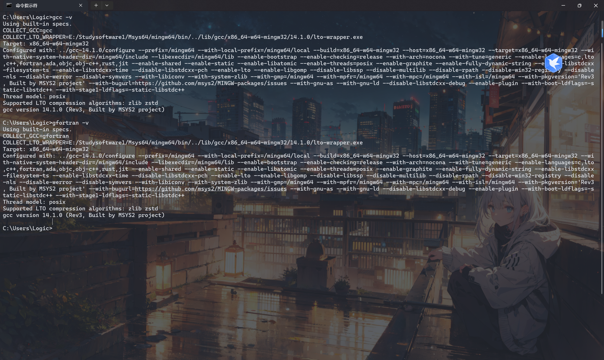
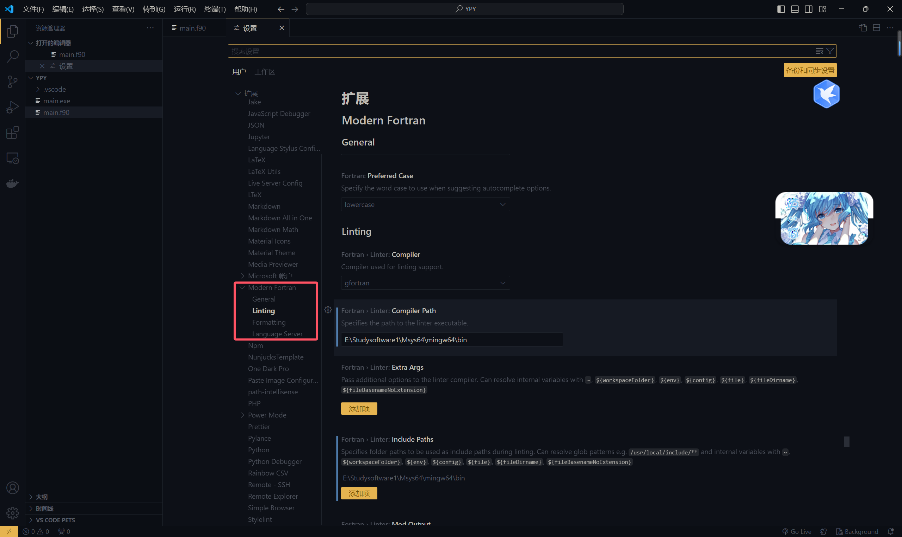
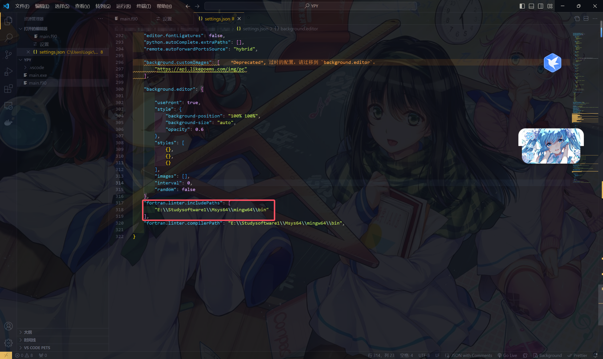

# 安装 Msys 2

## 清华大学开源软件镜像站

[msys2 | 镜像站使用帮助 | 清华大学开源软件镜像站 | Tsinghua Open Source Mirror](https://mirror.tuna.tsinghua.edu.cn/help/msys2/)

访问镜像目录下的 `distrib/` 目录
```
# x86_64
https://mirrors.tuna.tsinghua.edu.cn/msys2/distrib/x86_64/
# i686
https://mirrors.tuna.tsinghua.edu.cn/msys2/distrib/i686/
```

找到名为 `msys2-<架构>-<日期>.exe` 的文件（如 `msys2-x86_64-20141113.exe`），下载安装即可。
## pacman 的配置

运行 Msys 2，输入以下代码
```
sed -i "s#https\?://mirror.msys2.org/#https://mirrors.tuna.tsinghua.edu.cn/msys2/#g" /etc/pacman.d/mirrorlist*
```

# 安装 GFortran

## 安装 gcc

运行 Msys 2，输入以下代码
```
pacman -S gcc
```



## 安装 gfortran

使用 `pacman -Ss` 命令搜索软件
执行 `pacman -Ss gcc`，


执行以下代码，安装 gfortran
```
pacman -S mingw64/mingw-w64-x86_64-gcc-fortran
```

## 配置环境变量

打开 Msys 2 安装目录，打开 `mingw64/bin/`，查看是否有 `gfortran.exe`


复制路径，接下来我们需要打开环境变量，进行配置。此处省略具体操作步骤，大致的流程如下
`右键点击"此电脑" -> 选择"属性" -> 打开"高级系统设置" -> 打开"环境变量" -> 选择"系统变量"中的path，点击编辑 -> 选择"新建" -> 粘贴前面复制的路径`



然后注意点击"确定"进行保存。

接下来，打开终端进行检验（Cmd 和 PowerShell 皆可），执行以下命令
```
gcc -v
```

```
gfortran -v
```

如果结果类似下图，说明安装成功



# 配置 VScode

打开 VScode，安装 Modern Fortran 插件


打开设置，找到"扩展"中的"Modern Fortran"，


在 `Include Paths` 中添加前面复制过的路径。

或者直接打开最右上角的 `settings.json`

添加以下代码

```
"fortran.linter.includePaths": [
        "E:\\Studysoftware1\\Msys64\\mingw64\\bin"
    ],
```




# 示例代码演示

在终端中输入执行代码


至此，VScode + GFortran 就完全配置好了！~ o (≧▽≦)ツ