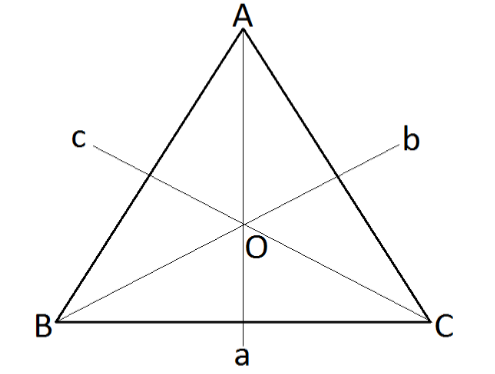
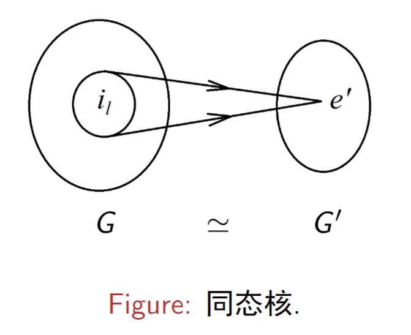
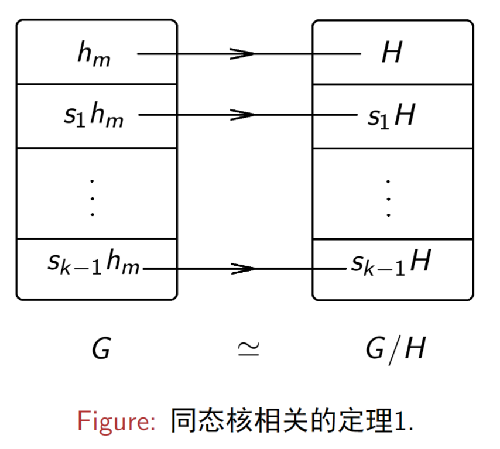

# 1 群的定义
## 1.1 个定义
在规定元素的"**乘积**"法则之后，满足以下**四个条件**的集合 G 称为群：
1. **封闭性**：对于 $\forall f, g \in G$， 都有 $f g \in G$. 
2. **结合律**：对于 $\forall f, g, h\in G$，都有 $(fg) h = f(gh)$.
3. **存在恒元**：$\exists e \in G$，对于 $\forall f \in G$，都有 $ef = fe = f$.
4. **存在逆元**： 对于 $\forall g \in G,  \exists g^{-1} \in G$，使得 $g g^{-1} = g^{-1} g= e$.

$e$ 称为群 $G$ 的恒元， $g^{-1}$ 称为元素 $g$ 的逆元。

## 1.2 个说明
- 若集合 $G$ 不满足条件 4，则被称为 "半群"。
- 群元可以是任何客体，比如数、矩阵、操作、算子等。
- 所谓的"乘积"法则不局限于乘法，也可以是其他运算或操作，比如加法、矩阵乘法、相继的两次的操作等。

## 1.3 个结论
1. 恒元 $e$ 是唯一的。
2.  $\forall g \in G$ 的逆元  $g^{-1}$ 是唯一的。
3. 恒元 $e$ 的逆元是它自身。
4.  $(g^{-1})^{-1} = g$。
5.  $(gf)^{-1} = f^{-1}g^{-1}, (gf\dots h)^{-1} = h^{-1}\dots f^{-1}g^{-1}$。

## 1.4 个概念
1. 群的元素的个数 $n_{G}$ 可以是有限的，也可以是无限的。群元个数有限的群称为**有限群**。
2. 有限群的元素个数 $n_{G}$ 称为 **有限群的阶**。
3. 群元个数无限的群称为 **无限群**。
4. 群元素离散的无限群称为**离散无限群**。
5. 群元素连续的无限群称为**连续无限群**。
6. **群元的阶**：对于 $\forall g \in G$，若 $g^{m} = e$， $m$ 是最小的正整数，则 $m$ 称为群元 $g$ 的阶。
7. **Abel 群**：若 $\forall g, f \in G$，有 $gf =fg$，则称群 $G$ 为可交换群或 Abel 群。

## 1.5 典型例子

### 1.5.1 由数构成的群
- 定义"乘法"为数的加法，则所有整数构成一个群，记作： $Z_{+} = (Z,+)$。**整数加法群**。
- 定义 "乘法"为数的加法，则所有实数构成一个群，记作：$R_{+} = (R, +)$。**实数加法群**。
- 定义 "乘法"为数乘，则所有非零的实数构成一个群，记作 $\bar{R}_{\times}$。**非零实数乘法群**。
- 存在数的除法群，如 $\{1\}$ 或 $\{1,-1\}$。但不存在数的非平庸除法群。
- 存在数的减法群，如 $\{0\}$。

### 1.5.2 $SO(2)$ 群（二维平面旋转群）
在二维平面中，将一个矢量沿逆时针方向转 $\alpha$ 角度，可以用下面的形式表示： 
$$
\begin{bmatrix}
x'  \\
y'
\end{bmatrix} = \begin{bmatrix}
\cos \alpha & -\sin \alpha \\
\sin \alpha & \cos \alpha
\end{bmatrix}\begin{bmatrix}
x \\
y
\end{bmatrix}
$$
其中 
$$
g(\alpha) = \begin{bmatrix}
\cos \alpha & -\sin \alpha \\
\sin \alpha & \cos \alpha
\end{bmatrix}
$$
称为旋转矩阵，为集合 $SO(2)$ 的元素，记作 
$$
G = SO(2) = \{g(\alpha)|\alpha \in [0,2\pi]\}
$$
$SO(2)$ 群也是 Abel 群，以及是一个 1 阶 Lie 群（只有一个独立的实参数 $\alpha$）。

### 1.5.3 正三角形对称群$D_{3}$

正三角形有三个对称轴 $a$ 、$b$、$c$，和一个对称中心 $O$。
群元是一系列对称操作，操作保证正三角形保持不变。
- 绕中心 $O$ 旋转 $120^{o}(d), 240^{o}(f), 360^{o}(e)$ 可以保持三角形不变。
- 绕对称轴 $a,b,c$ 旋转 $180^{o}$ 也能保持三角形不变。
保持正三角形变换不变的操作构成了 $D_{3}$ 群： 
$$
D_{3} = \{e,d,f,a,b,c\}
$$

### 1.5.4 一维空间连续平移群$T_{1}$
一维空间连续平移群的群元是平移操作： $T_{1} = \{T (a)|a\in R\}$，其中群元 $T(a)$ 可以表示： 
$$
T(a): x \to x + a
$$
或： 
$$
T(a) x = x + a
$$ 
---
# 2 群的重排定理
重排定理是关于群的一个重要定理，它的表述如下：
**假设 $G = \{g_{\alpha}\}$ 为群， $f$ 为 $G$ 中的一个确定的元素，则当 $\alpha$ 取遍所有可能的取值时， $f g_{\alpha}$ 给出且仅仅一次给出 $G$ 的所有元素，即
$$
G =\{g_{\alpha}\}  = \{fg_{\alpha}\}
$$
1. **先证 $\{fg_{\alpha}\} \subseteq G = \{g_{\alpha}\}$**
2. **再证 $G\subseteq\{f g_{\alpha}\}$**
3. **最后证 $\{f g_{\alpha}\}$ 中没有重复元素**

推论：$\{g_{\alpha}f\}$ 也给出且仅仅一次给出 $G$ 中的所有元素

---
由于 $\{fg_{\alpha}\}$ 和 $\{g_{\alpha}f\}$ 分别代表乘法表的某一行和某一列，因此：
- 群乘法表中的每一行、每一列都是 $G$ 的元素的**重新排列**。
- 乘法表每个元素在每行每列中只出现一次。
- 乘法表的任意两行、两列都不会相同。

---

# 3 子群和陪集

## 3.1 子群的定义
若群 $G$ 的非空子集 $H$ 也构成一个群（相同的乘法），则 $H$ 称为群 $G$ 的一个**子群**。
易证：子群 $H$ 为 $G$ 的子群的条件为：
- 封闭性：即 $\forall h_{\alpha}, h_{\beta}\in H$，有 $h_{\alpha} \cdot h_{\beta}\in H$。
- 存在逆元： $\forall h_{\alpha}\in H, \exists h_{\alpha}^{-1}$ 使得 $h_{\alpha}\cdot h_{\alpha}^{-1} = e$。

每一个非平庸群 $G$ 最少有两个子群，一个是它自身，另一个是 $\{e\}$，这两个子群称为群 $G$ 的 **平庸子群** ，除此之外的子群称为 **固有子群**。

## 3.2 关于子群的一些结论
- 子群 $H$ 的恒元就是群 $G$ 的恒元
- $H H = H$

## 3.3 子群的陪集
假设 $H$ 为群 $G$ 的一个子群，有元素 $f\in G$，且 $f \notin H$，则 $fH = \{f h_{\alpha}\}$ 称为子群 $H$ 关于 $f$ 的 **左陪集**。类似地， $H f = \{h_{\alpha}f\}$ 称为子群 $H$ 关于 $f$ 的**右陪集**。

若 $H$ 为有限群，则 $n_{fH} = n_{Hf} = n_{H}$。

注意，因为 $e \notin fH$，所以 **陪集不是群**。

因为左陪集 $fH$ 和右陪集 $Hf$ 总是有一个共同元素 $ef = fe  =f$，所以同一个子群关于同一个元素的左右陪集总是有交集的。

## 3.4 陪集定理
陪集定理是同一个子群关于不同元素的左（右）陪集的定理。

**陪集定理**：子群 $H$ 的两个左陪集（右陪集）要么完全重合，要么没有公共元素。

## 3.5 拉格朗日定理
拉格朗日定理是一个关于有限群的子群的阶的定理。

**拉格朗日定理**：有限群的子群的阶等于群阶的因子。

**推论**：
1. 阶为素数的群 $G$ 没有非平庸子群，这种群只能是循环群。但需要注意，**循环群可能有非平庸子群**，例如 $C_{4}$ 有子群 $C_{2}$。
2. 若 $n_{G}$ 是非素数，则 $n_{G}$ 可以分解成其因子的乘积：  
$$
n_{G} = n_{1}\times n_{2}  = n_{3} \times n_{4} = \dots
$$
   设 $\forall g \neq e, g^{m} = e$，则
$$
H_{g} = \{g, g^{2}, \dots g^{m} = e\}
$$ 
构成  $G$ 的一个 $m$ 阶子群，由拉格朗日定理知 $m$ 是 $n_{G}$ 的因子，即 $m = n_{i}$ 或 $n_{G}$。
- 若 $m = n_{i} \lt n_{G}$，则 $H_{g}$ 为 $G$ 的一个非平庸循环子群。
  例如：对 $D_{3}$ 群， $d$ 的阶为 $3$， $\{d, d^{2} = f, d^{3}= e\}$ 为三阶循环子群。
- 若 $m = n_{G}$，则 $G$ 为非素数阶的循环群，它必有非平庸子群。
  例如：对 $C_{4}$ 群， $c_{4}$ 的阶为 $4$， $\{c_{4}^{2}, c_{4}^{4} = e\}$ 为 $2$ 阶循环子群。

## 3.6 经典群的例子
- $GL(n, C)$ 和 $GL(n,R)$ 群——一般线性变换群
  定义集合：
$$
\begin{align}
GL(n, C) = \{A|A\text{为} n\times n\text{的复矩阵}, \text{且} \det A \neq 0\} \\
GL(n, R) = \{A|A\text{为} n\times n\text{的实矩阵}, \text{且} \det A \neq 0\}
\end{align}
$$
  乘积法则都定义为矩阵的乘法。
  
- $SL(n,C)$ 和 $SL(n,R)$ 群——特殊线性变换群
  定义集合：
$$
\begin{align}
SL(n, C) = \{A|A\text{为} n\times n\text{的复矩阵}, \text{且} \det A = 1\} \\
SL(n, R) = \{A|A\text{为} n\times n\text{的实矩阵}, \text{且} \det A = 1\}
\end{align}
$$
  乘积法则都定义为矩阵的乘法。
  
- 幺正群和正交群
  幺正群和正交群都是一般线性变换群的特殊情况：
$$
\begin{align}
\text{幺正群：} U(n) = \{A|A\in GL(n, C), A A^{\dagger} = E\} \\
\text{特殊幺正群：} SU(n) = \{A|A\in U(n), \det A = 1\} \\
\text{正交群：} O(n) = \{A|A\in GL(n,R), A^{T}A = E\} \\
\text{特殊正交群：} SO(n) = \{A|A\in O(n), \det A = 1\}
\end{align}
$$
$$
\begin{array}{cccc}GL(n,C)&\supset&GL(n,R)\\\cup&\cup&\cup \\\underbrace{U(n) \quad SL(n,C)}_{\cup}&\supset&\underbrace{SL(n,R) \quad O(n)}_{\cup}\\SU(n)&\supset&SO(n)\end{array}
$$
---

# 4 共轭元素和类

## 4.1 共轭元素的定义
设  $g_{\alpha}, g_{\beta}\in G$，若 $\exists f \in G$ 使得：
$$
g_{\alpha} = f g_{\beta}f^{-1}
$$
则称 $g_{\alpha}$ 和 $g_{\beta}$ 互为**共轭元素**，记为 $g_{\alpha} \sim g_{\beta}$。

## 4.2 共轭元素的性质
1. 若 $g_{\alpha}$ 与 $g_{\gamma}$ 共轭，  $g_{\beta}$ 与 $g_{\gamma}$ 共轭，则 $g_{\alpha}$ 与 $g_{\beta}$ 共轭。——"传染"性
2. 若 $g_{\alpha}\sim g_{\beta}$， $g_{\beta}\sim g_{\gamma}$，则 $g_{\alpha}\sim g_{\gamma}$。——传递性

## 4.3 类的定义
设 $\forall a \in G$，则 $G$ 中所有与 $a$ 共轭的元素组成的子集 $C_{a}$ 称为 $a$ 的**类**：
$$
C_{a} = \{g_{\alpha}ag_{\alpha}^{-1}|g_{\alpha}\in G\}
$$
由共轭的传染性可知， $C_{a}$ 中的元素互相共轭。

## 4.4 类的性质
1. **对于任何群，恒元自成一类**，因为与恒元共轭的元素只有它自身。
2.  **$Abel$ 群的每个元素自成一类**，因为 $Abel$ 群的元素乘积可交换。又因为 $n$ 阶循环群是 $Abel$ 群，所以 **$n$ 阶循环群的每一个元素自成一类**，共 $n$ 个类。
3.  $g_{\alpha}g_{\beta}\sim g_{\beta}g_{\alpha}$，即 $g_{\alpha}g_{\beta}$ 与 $g_{\beta}g_{\alpha}$ 在同一类中。
4. **同类元素的阶必然相同**。
5. **两个不同的类没有公共元素**，除了 $\{e\}$ 以外，类不是群。
6. **有限群的类的元素个数为群阶的因子**。

---
# 5 不变子群和商群
## 5.1 不变子群（群论中非常重要的概念）
- 定义一：**假设 $H$ 为 $G$ 的一个子群，若对于 $\forall g_{\alpha}\in G$，都有 $g_{\alpha}H = H g_{\alpha}$，则称 $H$ 为 $G$ 的不变子群**。
  
- 定义二：**假设 $H$ 为 $G$ 的一个子群，若 $H$ 中任意元素的共轭元素还在 $H$ 中，即对于 $\forall g_{\alpha}\in G, h_{\beta}\in H$，都有 $g_{\alpha}h_{\beta}g_{\alpha}^{-1} = h_{\gamma}\in H$，则 $H$ 为 $G$ 的不变子群。**

- 根据定义，显然 $\{e\}$ 和 $G$ 本身都是 $G$ 的不变子群
- 若 $G$ 的一个子群是 $Abel$ 子群 (**子群中的任意元素与 $G$ 中的元素都对易**)，则它一定是 $G$ 的不变子群。

## 5.2 不变子群的性质
- **左右陪集相同**。
- **若子群 $H$ 中的任意一个元素的共轭元素仍在 $H$ 中，则 $H$ 为不变子群**。
- **不变子群由多个类构成；反之，若一个子群由多个类构成，则其一定为不变子群**。
- **指数为 $2$ 的子群必为不变子群**。（设有限群 $G$ 的阶为 $n_{G}$，其子群 $H$ 的阶为 $n_{H}$， $\frac{n_{G}}{n_{H}}$ 称为子群 $H$ 的指数）

## 5.3 商群
设 $H$ 为 $G$ 的不变子群，则 $H$ 及其陪集串
$$
\left\{ \phi _{0} = H, \phi_{1} = s_{1}H, \dots \phi _{k- 1} = s_{k-1}H \right\},\text{其中} s_{i}\in G
$$
构成一个新的群，称为 **群 $G$ 关于不变子群 $H$ 的商群**，记为
$$
G / H
$$
商群的乘法由 $G$ 的乘法来确定：
$$
\begin{align}
\phi _{i}\phi _{j} &\equiv \{(s_{i}h_{\alpha})(s_{j}h_{\beta})|h_{\alpha}\in G, h_{\beta}\in H \} \\
\phi _{i}\phi _{j} &= s_{i}Hs_{j}H = s_{i}s_{j}H H = s_{i}s_{j}H = g_{\alpha}H
\end{align}
$$
证明商群满足群的定义：
1. 封闭性：
$$
\phi _{i}\phi _{j} = s_{i}Hs_{j}H = s_{i}s_{j}H H = s_{i}s_{j}H = g_{\alpha}H = \phi _{m}
$$
   给定 $H$ 之后，因为 $G$ 的陪集串是确定的，所有 $g_{\alpha}H$ 必为陪集串中的一个。
   
2. 恒元： $H$
$$
H(s_{i}H) = s_{i}H H = s_{i}H
$$
3. 逆元：
$$
(s_{i}H)(s_{i}^{-1}H) = s_{i}s_{i}^{-1}H H = H
$$
4. 结合律：
$$
\begin{align}
\phi _{i}(\phi _{j}\phi _{k}) &= s_{i}H(s_{j}Hs_{k}H) = s_{i}s_{j}s_{k}H \\
(\phi _{i}\phi _{j})\phi _{k} &= (s_{i}Hs_{j}H)s_{k}H = s_{i}s_{j}s_{k}H \\
\phi _{i}(\phi _{j}\phi _{k}) &=(\phi _{i}\phi _{j})\phi _{k}
\end{align}
$$

--- 
# 6 同构与同态
## 6.1 同构
设 $G = \{g_{\alpha}\}$ 和 $G' = \{g_{\alpha}'\}$ 为两个群，**群元之间存在一一对应关系 $g_{\alpha}\leftrightarrow g_{\alpha}'$，并且为满射，且 $G$ 中任意两个元素的乘积也按相同的对应关系**对应于 $G'$ **中相应两个元素的乘积**，则称 $G$ 和 $G'$**同构**，记作 $G\cong G'$。

**同构即具有相同的结构**，因此两个同构的群，**具有相同的乘法表**，反过来，若两个群的乘法表相同，则它们一定同构。

由拉格朗日定理可得：
- **阶为同一素数的两个群同构**（同为素数阶循环群）
- **无限群也存在同构**，比如 $SO (2)\cong U(1)$。
- 群的线性表示，就是群和某一种矩阵群的同构或同态关系。（$U(1)$ 群的群元 $g' (\theta) = e^{i\theta}$ 可以作为 $SO(2)$ 群的一维表示）

**当群元的阶不同时，群的乘法表结构就不相同，因此两个群就不可能同构。**

## 6.2 同态
同态和同构的定义区别仅在于将同构定义中的"一一对应"改为"多一对应"，由此看来，**同构是同态的一种特殊情形**。

设 $G = \{g_{im}\}$ 与 $G' = \{g_{i}'\}$ 之间有**多一对应关系**，并且为满射，且群 $G$ 中任意两个元素的乘积**也按相同的对应关系**对应于 $G'$ 中相应两个元素的乘积，即称 $G$ 与 $G'$ 同态，记作：$G\simeq G'$。

若两个群同态，则 **恒元与恒元对应，逆元与逆元对应**，即
$$
\text{若}G\simeq G', \text{则：}e\to e', g^{-1}\to g'^{-1}
$$
## 6.3 同态核（同态中非常重要的概念）
设 $G\simeq G'$，则 $G$ **中所有与 $G'$ 中的恒元 $e'$ 对应的元素的集合**称为**同态关系中的同态核**，记为：
$$
I = \{i_{l}\}
$$

## 6.4 同态核定理
同态核定理：**假设 $G\simeq G'$，$I$ 为同态核，则 $I$ 为 $G$ 的不变子群。**

1. 定理一：**设 $H$ 为 $G$ 的不变子群，则 $G\simeq G /H$，** 其中 $G / H = \{s_{0}H = eH, s_{1}H, s_{2}H,\dots, s_{k-1}H\} = \{s_{i}H\}$ 为群 $G$ 关于 $H$ 的商群。
2. 定理二：**设 $G\simeq G'$, $I$ 为同态核，则 $G / I \cong G'$。**

# 7 直积群
## 7.1 直积群的定义
**假设 $H = \{h_{\alpha}\}$， $F = \{f_{\beta}\}$ 为 $G$ 的两个子群，且满足：**
- 除恒元以外 $H$ 和 $F$ 没有公共的元素
- 两个子群的元素乘积可对易： $h_{\alpha} f_{\beta} = f_{\beta} h_{\alpha}$
**则 $K = \{h_{\alpha}f_{\beta}|h_{\alpha}\in H , f_{\beta}\in F\}$ 构成一个群，称为 $H$ 和 $F$ 的直积群，记为 $K = H \otimes F$，也称 $K$ 是 $H$ 和 $F$ 的直积， $H$ 和 $F$ 称为 $K$ 的直积因子。**

注：
- 没有要求 $H,F,G$ 其中任何一个为 $Abel$ 群
- 若 $H$ 和 $F$ 为有限群，则直积群 $K$ 的阶 $n_{K} = n_{H}\times n_{F}$
- $K$ 中无重复元素

### 7.1.1 直积群的例子
6 阶循环群 $C_{6} = \{e, a^{2}, a^{3}, a^{4}, a^{5}\}$ 有两个子群：
$$
C_{2} = \{e, a^{3}\}, C_{3} = \{e, a^{2} , a^{4}\}
$$

## 7.2 直积群的相关定理
**若 $K = H\otimes F$，则 $H$ 和 $F$ 均为 $K$ 的不变子群。**

## 7.3 直积群的类
设 $K = H\otimes F$，则 $K$ 关于 $hf$ 的类可以根据定义来计算：
$$
\begin{align}
C_{hf} &= \{(h_{\alpha}f_{\beta})hf(h_{\alpha}f_{\beta})^{-1}|h_{\alpha}\in H, f_{\beta}\in F\} \\
&= \{(h_{\alpha}hh_{\alpha}^{-1})(f_{\beta}ff_{\beta}^{-1})|h_{\alpha}\in H, f_{\beta}\in F  \} \\
&= C_{h}C_{f}
\end{align}
$$

即 : **$K$ 关于 $hf$ 的类**是 $H$ 关于 $h$ 的类和 $F$ 关于 $f$ 的类的集合乘积。

## 7.4 直积群的一般定义
对于任意的两个群 $H$ 和 $F$，它们的外直积定义为
$$
G = H\otimes F = \{(h,f)|h\in H, f \in F\}
$$

定义元素间的乘法
$$
g g' = (h, f)(h', f') = (h h', f f')
$$
则可证明，上述定义的集合构成群，称为 $H$ 和 $F$ 的外直积群。这里定义的外直积简称为直积。

设 $e_{F}$ 和 $e_{H}$ 分别为 $H$ 和 $F$ 的恒元，则 $(e_{H}, e_{F})$ 为 $G$ 的恒元。很容易验证， $(h, f)\in H\otimes F$ 的逆元为 $(h, f)^{-1} = (h^{-1}, f^{-1})$。

可证明 
$$
\bar{H} = \{(h,e_{F}|h \in H)\}
$$
$$
\bar{F} = \{(e_{H}, f)|f \in F\}
$$
是外直积群 $H\otimes F$ 的两个不变子群。此外， $G$ 关于 $(h,f)$ 的类为
$$
\begin{align}
C_{(h,f)} &= \{(h_{\alpha},f_{\beta})(h,f)(h_{\alpha}, f_{\beta})^{-1}|h_{\alpha}\in H, f_{\beta}\in F \} \\
 & = \{(h_{\alpha}hh_{\alpha}^{-1})(f_{\beta}ff_{\beta}^{-1})|h_{\alpha}\in H, f_{\beta}\in F\} \\
 & = C_{h}\otimes C_{f} 
\end{align}
$$
因此， $G$ 关于 $(h,f)$ 的类为 $H$ 关于 $h$ 的类和 $F$ 关于 $f$ 的类的直积。

更一般地，任意 $n$ 个群 $H, F, \dots,K$ 的外直积定义为
$$
\begin{align}
G &  = H\otimes F\otimes \dots \otimes K  \\
& = \left\{  \left( h,f,\dots,k \right)|h \in H, f \in F, \dots k \in K  \right\}
\end{align}
$$

定义元素间的乘法
$$
g g' = (h, f, \dots , k)(h',f', \dots, k') = \left( h h', ff', \dots, k k' \right) 
$$

则上面的集合也构成群，称为 $H, F, \dots, K$ 的直积群，且
$$
\begin{align}
\bar{H} &= \{ (h, e_{F}, \dots, e_{K} )| h\in H  \} \\
\bar{F} &= \{ (e_{H}, f, \dots, e_{K})|f \in F \} \\
\dots \\
\bar{K} &= \{ (e_{H}, e_{F}, \dots, e_{K})| k\in K \}
\end{align}
$$

是直积群的 $n$ 个不变子群， $G$ 关于 $(h,f, \dots,k)$ 的类为
$$
C_{(h, f, \dots,k)} = C_{h}\otimes C_{f}\otimes \dots \otimes C_{k}
$$

在第一个定义中：
$$
G = H\otimes F = \{ (h,f)|h \in H, f \in F \}
$$

$H$ 和 $F$ 可以是完全不同类型的群。如果 $H$ 和 $F$ 是群 $G$ 的两个子群，且
- 除恒元外没有相同的元素
- 两个子群的群元间的乘积可以交换
- 群 $G$ 的每个群元 $g$ 都可以唯一写成 $g =hf$，其中 $h \in H, f\in F$
则可以将 $H$ 和 $F$ 的直积定义为
$$
G= H\otimes F = \{ hf|h \in H, f \in F \}
$$
